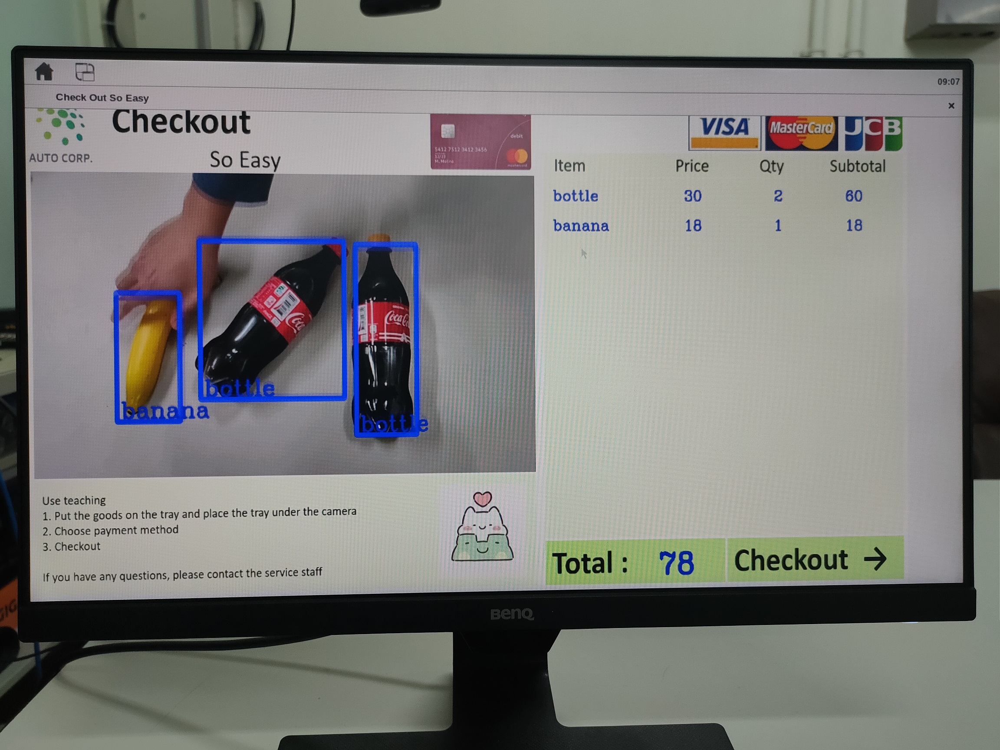

# **Self-checkout-system**
#### Self-checkout system for Adaptive Computing Developer Contest with Xilinx 2020 

#### Team MAAX

  

## Build and Setup the Environment of the ZCU104 board 

**If you use the `sd_card.img` in `prebuilt/`, you can skip these steps** 

### Build Steps

**1. Clone the full repository (including submodules)**

``$ git clone --recurse-submodules https://github.com/alex0620ee05/Self-checkout-system``

**Note: Vitis Patch Required:** This design has a large rootfs, and Vitis 2020.1 has an issue packaging SD card images with ext4 partitions over 2GB. This patch changes the packaging flow to round up the initial rootfs size to the first full multiple of 512MB over the ext4 partition size. To install it:

`$ cp ./vitis_patch/mkfsImage.sh ${XILINX_VITIS}/scripts/vitis/util`

**2. Source Vitis2020.1, PetaLinux2020.1 and XRT2020.1**

    $ source ${XILINX_VITIS}/settings64.sh
    $ source ${XILINX_PetaLinux}/settings.sh
    $ source ${XILINX_XRT}/setup.sh
    
**3. Build the hardware platform**

    $ cd platform/dev/zcu104_vcu
    $ make

* It's possible that errors occur when `petalinux-config kernel`, `petalinux-build`, `petalinux-build --sdk`. You should properly modify `Makefile` in `platform/dev/zcu104_vcu` and `platform/dev/zcu104_vcu/petalinux` to re do the command which got errors(`make` again in `platform/dev/zcu104_vcu`)

**4. Build the Vitis design(Adding the DPU ip)**

One time, and one time only, you must apply the patch in the hw_src directory against the Vitis Vision library.

    $ cd ../../../hw_src/Vitis_Libraries
    $ patch -p1 < ../vision_lib_area_resize_ii_fix.patch
    
    $ cd ..
    $ make

**5. Get the SD card image**
  
  After above steps, you will get `sd_card.img` is in `sd_card_zcu104/`.
  
  Or, you can download the prebuilt `sd_card.img`. (See <https://github.com/alex0620ee05/Self-checkout-system/tree/main/prebuilt/sd_card_image>) 
  
### Preparing the SD Card for Vitis AI Library v1.2

See <https://github.com/alex0620ee05/Self-checkout-system/blob/main/set_up_files/README.md> for more detail

### Reference

<https://github.com/Xilinx/Vitis-In-Depth-Tutorial/tree/master/Runtime_and_System_Optimization/Design_Tutorials/02-ivas-ml>
